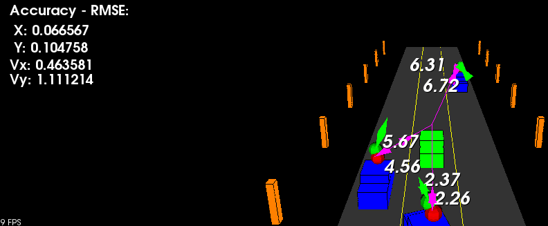

# Sensor Fusion Nanodegree

## Sensor Fusion UKF Highway Project
Luciano Silveira
July, 2020

### Specification



The objective is to implement an Unscented Kalman Filter to estimate the state of multiple cars on a highway using noisy lidar and radar measurements.

### Basic Build Instructions

1. Clone this repo.
2. Make a build directory: `mkdir build && cd build`
3. Compile: `cmake .. && make`
4. Run it: `./ukf_highway`

### Description

The project was addressed the following way:

* Move code from the quizzes while veryfing it compiles.
* Initialization, add new definitions in the `ukf.h` file.
* Review the [QA session](https://www.youtube.com/watch?v=gej_-2hxgck).
* Check if all matrixes and vectors are correctly initialized.
* Check division by zero.
* Try several initialization values.

### Troubleshooting

I got several errors and troubleshooting took time; the ones that took more time are:

* Initialization issues.
* Prevent division by zero or how to handle very low values.
* Angle normalization (Every operation involving angles should be normalized), I applied the tips from [here](https://discussions.udacity.com/t/ukf-getting-stuck-on-second-dataset/240080/23) and separated it to another function (`NormalizeAngle`).
* Parameters using ideas from [here](https://discussions.udacity.com/t/nis-for-radar-incorrect-over-estimated-certainty-for-system/352967) and [here](https://discussions.udacity.com/t/numerical-instability-of-the-implementation/230449).

### Accuracy

`px`, `py`, `vx`, `vy` output coordinates must have an `RMSE` <= `[0.30, 0.16, 0.95, 0.70]` after running for longer than 1 second.

The initial implementation got the correct values for `RMSE` up to the first seconds and then `vy` started to increment.

Based on the comments on this [thread](https://discussions.udacity.com/t/numerical-instability-of-the-implementation/230449/17) I applied the following modifications:

 * Change the initial covariance `P_` matrix to differ from the Identity matrix.

```cpp
P_ << 1, 0, 0, 0, 0,
    0, 1, 0, 0, 0,
    0, 0, 10, 0, 0,
    0, 0, 0, 50, 0,
    0, 0, 0, 0, 3; // Better results than Identity matrix
```

 * Minimize yaw acceleration `std_yawdd_` and longitudinal acceleration `std_a_` defaults to small values.

```cpp
std_yawdd_ = 0.9;
std_a_ = 1.;
```

### Lidar vs Radar

The results were compared using `radar`+`lidar` measurements, only `radar` or only using `lidar`. Modify the [ukf initialization](src/ukf.cpp) section to reproduce the different behaviors:

```cpp
// Debug and testing
debug_ = false;
//use_laser_ = false;
//use_radar_ = false;
```
When using only `radar` measurements is when it got the worst values, fluctuating values up to some meters.

### Links

 * [Original Repository](https://github.com/udacity/SFND_Unscented_Kalman_Filter)
 * [Project Rubric](https://review.udacity.com/#!/rubrics/2551/view)
 * [My UKF implementation in Self-Driving Car Nanodegree Program](https://github.com/ladrians/CarND-Unscented-Kalman-Filter-P7/)
